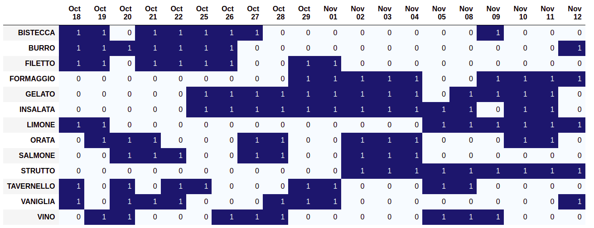

<!-- PROJECT LOGO -->
<br />
<div align="center">
  <a href="https://github.com/colibri17/back-to-office">
    
  </a>

  <h3 align="center">Back To Office Optimizer</h3>

  <p align="center">
    An optimization algorithm applied to plan the returns to the office or smartworking days for your team.
    <br />
    ·
    <a href="https://github.com/colibri17/back-to-office/issues">Report Bug</a>
    ·
    <a href="https://github.com/colibri17/back-to-office/issues">Request Feature</a>
  </p>
</div>


<!-- TABLE OF CONTENTS -->
<details>
  <summary>Table of Contents</summary>
  <ol>
    <li>
      <a href="#about-the-project">About The Project</a>
      <ul>
         <li><a href="#built-with">How it works</a></li>
         <li><a href="#built-with">Built With</a></li>
      </ul>
    </li>
    <li>
      <a href="#getting-started">Getting Started</a>
      <ul>
        <li><a href="#prerequisites">Prerequisites</a></li>
        <li><a href="#installation">Installation</a></li>
      </ul>
    </li>
    <li><a href="#usage">Usage</a></li>
    <li><a href="#roadmap">Roadmap</a></li>
    <li><a href="#contributing">Contributing</a></li>
    <li><a href="#contact">Contact</a></li>
  </ol>
</details>


<!-- ABOUT THE PROJECT -->
## About The Project

This project aims to provide a tool to all managers for better planning the presence of the resources to the office 
or the scheduling of smartworking days.

This planning can be really complicated to perform for humans. Especially if 
there are many constraints to take into account (e.g. return preferences, workstations, maximum 
room capacities and so on), choosing the best configuration can be really hard. Furthermore, 
there are generally no guarantees that the identified solution is the optimal one.

In this regards, an optimization algorithm can help. It can take 
into account different factors, define hard constraints to prevent specified configurations,
and allow to mathematically be sure that the proposed solution is the optimal one.


<p align="right">(<a href="#top">back to top</a>)</p>

### How it works
To optimize the planning, an integer optimization algorithm is used. The optimization model is composed by three main objects:
1. _The decision variables_  
Each decision variable is a binary variable x<sub>ij</sub> which represents whether the resource i on day j 
comes back to the office. The number of resources and the number of days to consider can be both
selected within the code.   
Along with these variables, we defined some non-linear decision variables that are obtained as the product of two or more binary variables and
that are used within the code to express terms in the objective functions or in the constraints. 
2. _The objective function_  
The objective function is composed by different terms.
   1. _consecutive days_ - For a resource is easier to come back on consecutive week days, so whenever this occurs the objective function is increased by 1
   2. _same team_ - For a team working together it is better to come back on the same days, so whenever this occurs the objective function is increased. 
   More precisely, if 2 team members come back on the same day the objective function is increased by 1. If 3 team members come back on the same day the objective function is increased by 2, and so on.
   3. _Target presence_ - Every resource should comes back a minimum number of days, encouraging some equity in the returns to the office. So, whenever a resource
   does not reach the mean presence of 2 days a week on the planning period, a penalty equal to the number of missing days is added to the objective function.
   4. _Single returns_ - Return to the office should be encouraged, so the objective function is increased of 1 for each return.

These 4 terms can be weigthed according to personal preferences. Within the code, they all have the same weight. 

3. _The constraints_
There are different types of constraints in the algorithm. Each type is derived from a supposed contingency which is not general and can be customized.
   1. _maximum and minimum number of resources_ - There is a maximum and minimum number of resources which can return to the office each day. The optimization
   algorithm prevents from finding solutions which exceed this maximum number or are below the minimum number. 
   2. _preference days_ - The resources are allowed to choose what are the days to come back and what are the days to not come back. The optimization
   algorithm finds solutions which agree with these preferences.
   3. _linearization constraints_ - Since we want the problem to be linear, non-linear variables are linearized by introducing some extra constraints. 
   This allows to use a linear optimizer making the problem easier to solve optimally.  

As the terms in the objective functions, the constraint types can be customized according to the user preferences and needs. For example,
you might want to remove the preference day constraints, or add some more. Also, notice that according to the needs some terms added to the objective function
might become constraints and vice versa.

<p align="right">(<a href="#top">back to top</a>)</p>

### Built With

This section list any major frameworks/libraries used to bootstrap the project:

* [Python](https://www.python.org/)
* [PuLP](https://coin-or.github.io/pulp/)
* [Pandas](https://vuejs.org/)

<p align="right">(<a href="#top">back to top</a>)</p>


<!-- GETTING STARTED -->
## Getting Started

To get a local copy up and running follow these simple example steps.

### Prerequisites

You have to install Python on your system. On Ubuntu 16.10 or newer, this can be done:
  ```sh
  sudo apt-get update
  sudo apt-get install python3
  ```

### Installation

1. Clone the repo
   ```sh
   https://github.com/colibri17/back-to-office
   ```
2. Install `Pandas` and `Pulp` libraries using `pip` 
   ```sh
   pip install -u pandas pulp 
   ```

<p align="right">(<a href="#top">back to top</a>)</p>


<!-- USAGE EXAMPLES -->
## Usage

To run the optimization model we need to fill the Excel file `preferences3.xlsx` which contains the resource preferences
for returning to the office. The rows in the file represent one resource, whereas the columns represents days. Each cell should be colored
either in red or in green (colors `FFFF0000`, `FF92D050` have to be used, respectively). Red means that
resource cannot come back on that day, green means that resource can come back instead. A sample configuration file is provided `preferences3.xlsx`
and you can adapt it to your needs.

All the code necessary to execute the optimization model is in the notebook `optimizazion.ipynb`.
The notebook has the following structure:
- _Setup_ - All the module imports are located in here
- _Parameters_ - In the section there are all the input parameters necessary for running the model
- _Optimization_ - The decision variables, objective function, constraints are defined in this section. Also, the model is run and the 
optimal solution is derived.
- _Results_ - The optimization results are collected and saved.
Use this space to show useful examples of how a project can be used. Additional screenshots, code examples and demos work well in this space. You may also link to more resources.

<p align="right">(<a href="#top">back to top</a>)</p>


<!-- ROADMAP -->
## Roadmap

- [ ] Refactor code using object oriented programming
- [ ] Add tests
- [ ] Create a dashboard to use the algorithm
- [ ] Dockerize 

See the [open issues](https://github.com/colibri17/back-to-office/issues) for a full list of proposed features (and known issues).

<p align="right">(<a href="#top">back to top</a>)</p>


<!-- CONTRIBUTING -->
## Contributing

Contributions are what make the open source community such an amazing place to learn, inspire, and create. Any contributions you make are **greatly appreciated**.

If you have a suggestion that would make this better, please fork the repo and create a pull request. You can also simply open an issue with the tag "enhancement".
Don't forget to give the project a star! Thanks again!

1. Fork the Project
2. Create your Feature Branch (`git checkout -b feature/AmazingFeature`)
3. Commit your Changes (`git commit -m 'Add some AmazingFeature'`)
4. Push to the Branch (`git push origin feature/AmazingFeature`)
5. Open a Pull Request

<p align="right">(<a href="#top">back to top</a>)</p>


<!-- CONTACT -->
## Contact

Alberto Prospero - [@LinkedIn](https://www.linkedin.com/in/albertoprospero/) - alberto.prospero@hotmail.com

Project Link: [https://github.com/colibri17/back-to-office](https://github.com/colibri17/back-to-office)

<p align="right">(<a href="#top">back to top</a>)</p>
